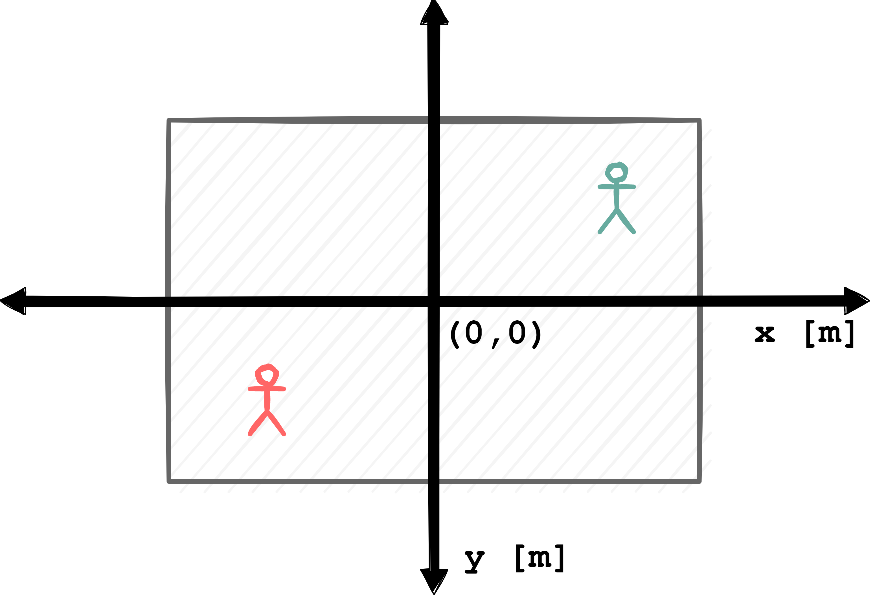
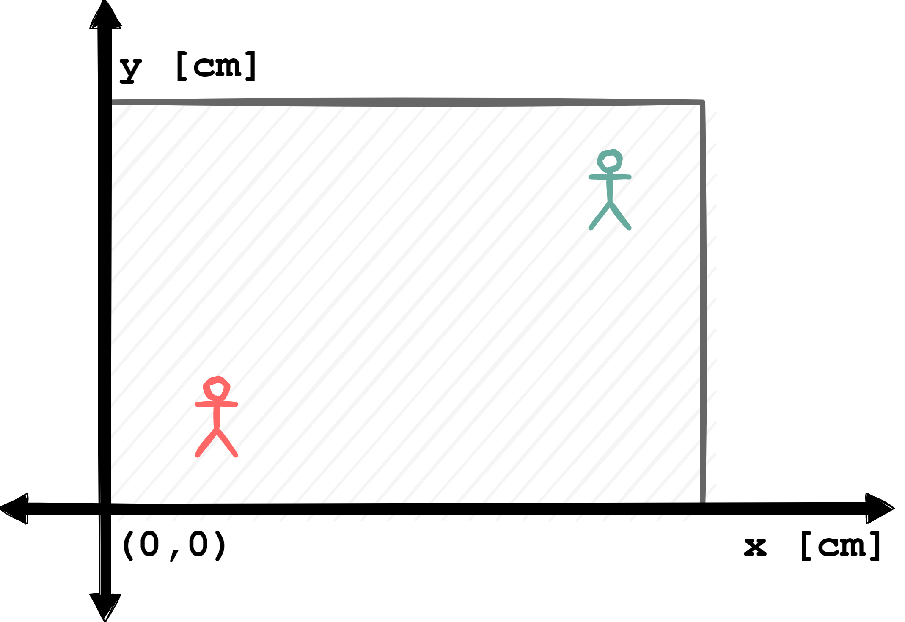
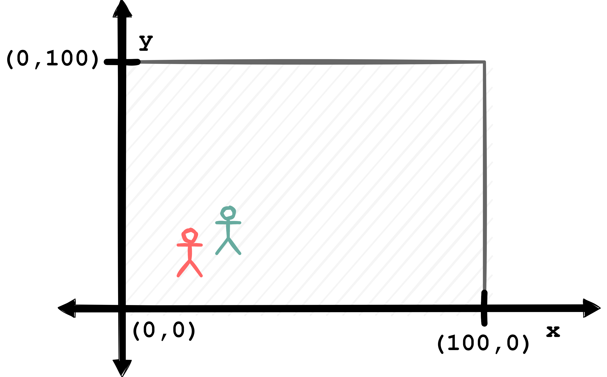

======================================
Space - Coordinate Systems and Pitches
======================================

Space, next to time, is the second primary data dimension that is of importance when handling sports data. For position data, as the name suggest, both dimensions are crucial, which is why they are often called spatiotemporal data in the scientific literature. Event data, in contrast, could technically live only in the temporal domain, without any spatial information attached. Locating events on the pitch is nonetheless of great interest, and many data providers include information as to where events happen on the pitch.

There exists, however, a major difference across data providers as to how they handle space. Most providers use a Cartesian coordinate system as the basis to represent locations. Thus, at this point, we do not provide any functionality on handling latitudes and longitudes as they may be exported from GPS trackers. The actual coordinate systems being used by providers are not always the same though, so we'll start with dissecting a few common formats before we discuss our approach.

.. NOTE::

    The dimension of playing grounds can - in some sports - change from location to location. There are typically preferred sizes (e.g. documented by the FIFA in football), but also allowed ranges. Changing pitch sizes are the main reason why handling space (across games and providers) is a little complex.

Coordinate Systems
==================

Lets start with a quick example. The most straightforward way to fixate position data in a coordinate system is to center the playing field. This way, the center mark of the pitch is at the coordinate *(0,0)*. It looks something like this:

You can easily interpret a player's position, i.e. if his coordinates at some point are *(42, -21)* you know that he is 42 m right and 21 m below the center of the pitch. However, you need to know the unit of measurement to be on the correct scale. Some providers use meters, some use centimeters.

Another common version is to align the bottom left corner at the origin. This ensures all position data to carry positive values, unless someone is stepping over the left or bottom sidelines of the pitch (which happens). In our sketch, both dummy players fortunately are in safe territory, so it looks like this:

This highlights a second important information: pitch sizes. The data itself does not tell you whether somebody is in or out of bounds. To stick with our example (and the all-positive-numbers sketch), imagine a player is standing at *(120,0)*. Unless you know the pitch size of the *x*-dimension (also called longitudinal side), you can't tell if he or she is stepping out of line.

Pitch size information is typically known, often from provider meta files. It has to be somehow incorporated, though. Its also possible to estimate length and width by checking all player's min- and max-positions over the course of a segment, but this will most likely be a quite biased estimate, especially if someone is *really* stepping out of line.

So far, it hasn't really become *too* complicated, but there's another common format: standardized pitches. If one is interested in comparing data across different matches, and if these matches were to be played on differently sized pitches, this can cause problems. Imagine you want to analyze events with respect to some sort of zonal system, then these zones need to be adapted to each and every pitch format.

To unify the data, some providers (noticeably for event data) have decided to project all data to a standardized pitch. Opta's pitch, for example, is a 100 long, and a 100 wide. No unit of measurement really applies here, but one can interpret the values as "percentages". An Opta pitch looks like this:

That's a helpful approach if you want to compare locations across matches (and thus pitches). For example, plotting all locations from where a player has taken shots over the course of a season becomes rather easy if all available data is projected to the same pitch dimension.

It is problematic though if you want to compute anything that involves distances. All metric information gets distorted during standardization, and all related calculations require a mapping back to actual pitch sizes to be correct.

There is another aspect to standardization. Maybe you noticed that the two players on the sketched pitch have gathered on the left side of the pitch. In order to standardize, some providers will not only re-scale pitch dimensions, but playing directions as well. Consider the plotting example just mentioned. It's quite handy if the player in question has taken all of his or her shots on the same side of the pitch. As a result, in Opta's raw data, everybody is always playing from left to right.

These examples include the most common approaches we've encountered to define the space where position data are encoded. All have pro's and con's, and we are not the ones to judge. We'd like to incorporate all these formats which begs the question as how to make all these pitches work together. Or, on an implementation level, how can we design a general data structure that makes transformations between these pitches straightforward.

Decoupling Data and Pitches
===========================

In our attempt, the first step towards achieving this is to extract all properties necessary to pin down the exact format of a certain playing surface. We've covered that previously, so let's summarize:

Unit of measurement
    Whats x and y measured in?
Pitch dimension
    Whats the length and with of the pitch?
Anchoring
    Wheres the pitch "anchored" on the coordinate system, i.e. where exactly is *(0,0)*?
Standardization
    Are the positions "actual" points in meter or centimeter, or on some form of standardized/projected pitch?
Playing direction
    What's the direction of play, per team?

On top, there are some implicit assumptions we need to be aware of: Up to this point, we are moving fully Euclidean (we'll come to polar coordinates later) and everything is happening in Cartesian coordinate system. Also, we want our pitch to be rectangular (`sorry, Bangkok <https://mymodernmet.com/non-rectangular-soccer-field-thailand/>`_).

From a technical standpoint, there is one observation that can be made: The data don't care about the space they live in. As long as we go with our assumptions, they are just points in a space. We *actually* need all this pitch information purely for "semantics", i.e., for us and our algorithms to make sense of whats actually happening with our data.

Thus, we made two design choices around this: First, we do not incorporate any pitch information into our data objects (XY and Events). Except for the playing direction, which we treat as an innate attribute to positions. Besides that, the raw data is fully decoupled from any pitch information. That does not prohibit us from using spatial transformations for the data though, they are just completely independent of the underlying pitch. You may rotate a XY object 90 degrees like

.. code-block:: python

    xy.rotate(90)

but that's just the mathematical operation of rotating all points counterclockwise around the origin. If that puts your back-four to the stands, well, that's semantics.

The second choice is to create a dedicated core object, named Pitch, that handles all information about the pitch. It does so, however, without explicitly specifying the underlying Cartesian coordinate system. Its attributes instead specify *how the pitch is located within this coordinate system*.

The Pitch object
================

The :doc:`Pitch <../modules/core/pitch>` object collects pitch properties as class attributes. This is how the class looks like:

.. code-block:: python

    @dataclass
    class Pitch:

        xlim: Tuple[Numeric, Numeric]
        ylim: Tuple[Numeric, Numeric]
        unit: str
        boundaries: str
        length: Numeric = None
        width: Numeric = None
        sport: str = None

Most of the attribute match a point in the list we collected above.

* ``unit`` refers to the unit of measurement, something like ``"m"``, ``"cm"`` or ``"percent"``
* ``boundaries`` is either ``"fixed"`` or ``"flexible"``, to indicate if the pitch is standardized
* ``length`` and ``width`` store the actual pitch size
* ``sport`` is an additional information of what sport the pitch is designed for - this can be used to generate special pitch markings automatically.

You may have noticed that there also is ``xlim`` and ``ylim`` on top, and that these attributes are even required for initialization. Both objects look exactly like *matplotlibs* axes limits, and they anchor the pitch within the coordinate system, by telling pitch boundaries in both dimensions.

For example, a pitch of 100m x 50m size that is flexible and centered around the origin has

.. code-block:: python

    xlim = (-50, 50)
    ylim = (-25, 25)

whereas the Opta pitch reads

.. code-block:: python

    xlim = (0, 100)
    ylim = (0, 100)

Notice that you don't technically need the actual pitch length and widths to process the data, they are purely optional. In case of the first pitch, they are easily derived from the x- and ylim properties. But not in the case of the Opta pitch.

Both ``xlim`` and ``ylim`` fully encode pitch boundaries, and we found they make handling pitches very easy in many algorithms. That's why we made them the essential class attribute. All other attributes are "on top" and tell you more about the pitch, and some of them are needed, especially if you do distance calculations.

Note that for convenience we've included major data provider pitches as templates that you can call (with additional parameters that are not known a priori) by running

.. code-block:: python

    pitch = Pitch.from_template("opta", length=110, width=68)

All parser methods that read provider data as well as dataset classes also supply an appropriate ``Pitch`` object.
