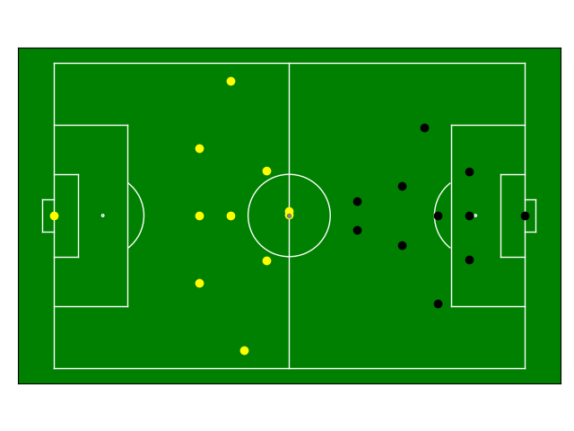
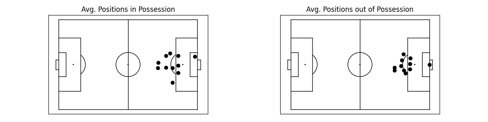

===============
Getting Started
===============

Here's everything you need to know to quickly get set up and start using floodlight!

Installation
============

The package can be installed via pip

.. code-block:: bash

    pip install floodlight

and then imported into your local Python environment

.. code-block:: python

    import floodlight

Loading Data
============

As this is a data analysis package, the obvious first step is to get some data.

Provider Data
-------------

If you have data files saved in a specific provider format, see if there is matching parser in the :doc:`io <../modules/io/io>` module. Parsing might work slightly different depending on the specific provider file types. But in essence, there is one submodule per supported provider, and one function per file type. In cases where parsing requires multiple files (e.g. when you have a data containing position data and an attached metadata file), there is one function that does so.

Let's look at a quick example loading Tracab position and Opta event data:

.. code-block:: python

    from floodlight.io.tracab import read_tracab_files
    from floodlight.io.opta import read_f24

    filepath_dat = <filepath_to_tracab_dat_file>
    filepath_meta = <filepath_to_tracab_metadata_file>
    filepath_f24 = <filepath_to_opta_f24_feed>

    (
        xy_home_ht1,
        xy_home_ht2,
        xy_away_ht1,
        xy_away_ht2,
        xy_ball_ht1,
        xy_ball_ht2,
        possession_ht1,
        possession_ht2,
        ballstatus_ht1,
        ballstatus_ht2,
        pitch_xy,
    ) = read_tracab_files(filepath_dat, filepath_meta)

    (
        events_home_ht1,
        events_home_ht2,
        events_away_ht1,
        events_away_ht2,
        pitch_events
    ) = read_f24(filepath_f24)

Sample Data
-----------

An alternative to proprietary provider data are public datasets. We provide classes to access some of these datasets in the :doc:`datasets <../modules/io/datasets>` submodule. We've also included a small dataset of synthetic match data for instructional and testing purposes. Load them by running:

.. code-block:: python

    from floodlight.io.datasets import ToyDataset

    dataset = ToyDataset()

    (
        xy_home_ht1,
        xy_away_ht1,
        xy_ball_ht1,
        events_home_ht1,
        events_away_ht1,
        possession_ht1,
        ballstatus_ht1,
    ) = dataset.get(segment="HT1")

    (
        xy_home_ht2,
        xy_away_ht2,
        xy_ball_ht2,
        events_home_ht2,
        events_away_ht2,
        possession_ht2,
        ballstatus_ht2,
    ) = dataset.get(segment="HT2")

    pitch = dataset.get_pitch()

Note that the sample data is already projected to the same pitch, so there are no separate objects for tracking data and events.

Data Manipulation
=================

We proceed with the data queried from the ToyDataset, but if you've loaded provider data, the steps are actually the same.

At this point, you've got a whole bunch of core objects for both teams and both halftimes. Each core class stores a different kind of sports data, such as tracking data, event data, or codes:

.. code-block:: python

    print(xy_home_ht1)
    # Floodlight XY object of shape (100, 22)
    print(events_home_ht1)
    # Floodlight Events object of shape (17, 4)
    print(possession_ht1)
    # Floodlight Code object encoding 'possession'
    print(pitch)
    # Floodlight Pitch object with axes x = (-52.5, 52.5) / y = (-34, 34) (flexible) in [m]

Now that we have some objects loaded, let's manipulate them. Below are just a few examples, for all methods check out the respective class methods in the :doc:`core <../modules/core/core>` module reference.

.. code-block:: python

    # rotate position data 180 degrees (counter-clockwise)
    xy_home_ht1.rotate(180)
    # show only x coordinates
    print(xy_home_ht1.x)
    # show points of 3rd player (xID=3)
    xy_home_ht1.player(3)
    # slice position data to first 100 frames
    xy_home_ht1.slice(startframe=0, endframe=100, inplace=True)

    # print coordinates of pitch middle
    print(pitch.center)

    # add "frameclock" column to events object
    events_away_ht1.add_frameclock(5)
    # show all "Pass" events within first 800 frames
    events_away_ht1.select(conditions=[("eID", "Pass"), ("frameclock", (0, 800))])

    # check what's stored in code object
    print(possession_ht1.definitions)
    # slice ball possession code to first 10 frames
    possession_ht1.slice(startframe=0, endframe=10, inplace=True)

Plotting
========

All plotting is based on the `matplotlib <https://matplotlib.org/>`_ library, and also follows the matplotlib syntax. All low-level plotting functionality can be accessed via the :doc:`vis <../modules/vis/vis>` module, but some core objects have a ``.plot()``-method which is a convenience wrapper for plotting.

Plotting functions and methods accept an ``ax`` argument, which is an matplotlib.axes on which the plot is created (and create one if none is given). This allows to plot in the same fashion as is known from matplotlib:

.. code-block:: python

    import matplotlib.pyplot as plt

    # create a matplotlib plot
    fig, ax = plt.subplots()
    # plot the pitch
    pitch.plot(ax=ax)
    # plot the players for the first time-step
    xy_home_ht2.plot(t=0, color='black', ax=ax)
    xy_away_ht2.plot(t=0, color='yellow', ax=ax)
    xy_ball_ht2.plot(t=0, ball=True, ax=ax)

Example: Average Positions
==========================

To put everything together, let's look at a quick example where we calculate the average positions of the home team - depending on them having ball possession or not.

.. code-block:: python

    import numpy as np
    from floodlight import XY

    # index XY object based on Code object and take the mean along the first axis (time dimension)
    avg_in_pos = np.mean(xy_home_ht2[possession_ht2 == 1], axis=0)
    # create a new dummy XY object with a single frame
    avg_in_pos = XY(avg_in_pos.reshape(1, -1))
    # the same with non-possession frames
    avg_out_of_pos = np.mean(xy_home_ht2[possession_ht2 == 2], axis=0)
    avg_out_of_pos = XY(avg_out_of_pos.reshape(1, -1))

    # create subplots and plot data
    fig, axs = plt.subplots(1, 2)

    pitch.plot(ax=axs[0], color_scheme='bw')
    axs[0].set_title("Avg. Positions in Possession")
    avg_in_pos.plot(t=0, ax=axs[0])

    pitch.plot(ax=axs[1], color_scheme='bw')
    axs[1].set_title("Avg. Positions out of Possession")
    avg_out_of_pos.plot(t=0, ax=axs[1])

Next Steps
==========

Once you are familiar with loading and handling core data structures, make sure to check out the module reference for advanced computations involving these object. For example, the :doc:`transforms <../modules/transforms/transforms>` module contains data transformation functions, whereas the :doc:`models <../modules/models/models>` module contains data models. The tutorials provided in the documentation are another starting point to learn more about data analysis with floodlight!
