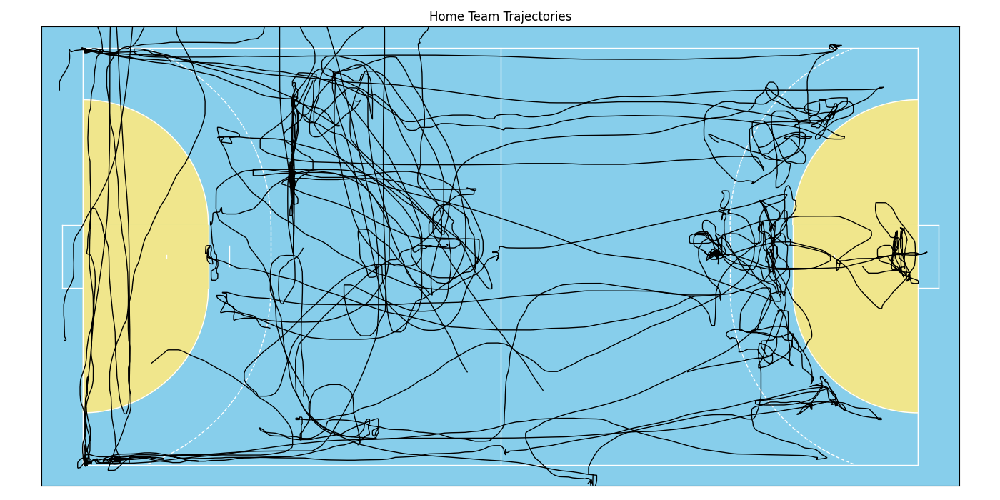
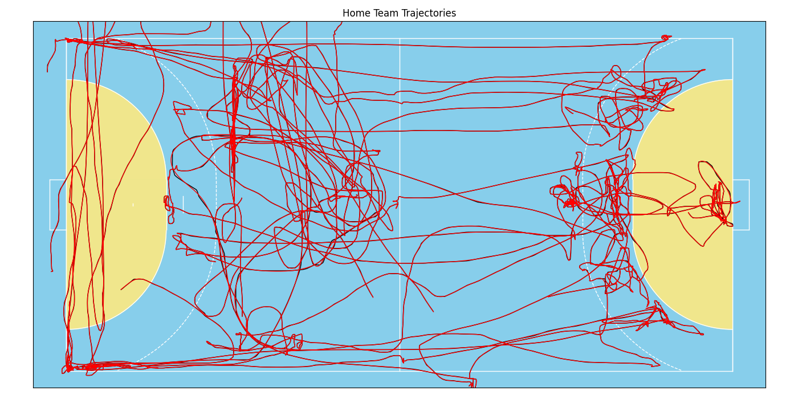
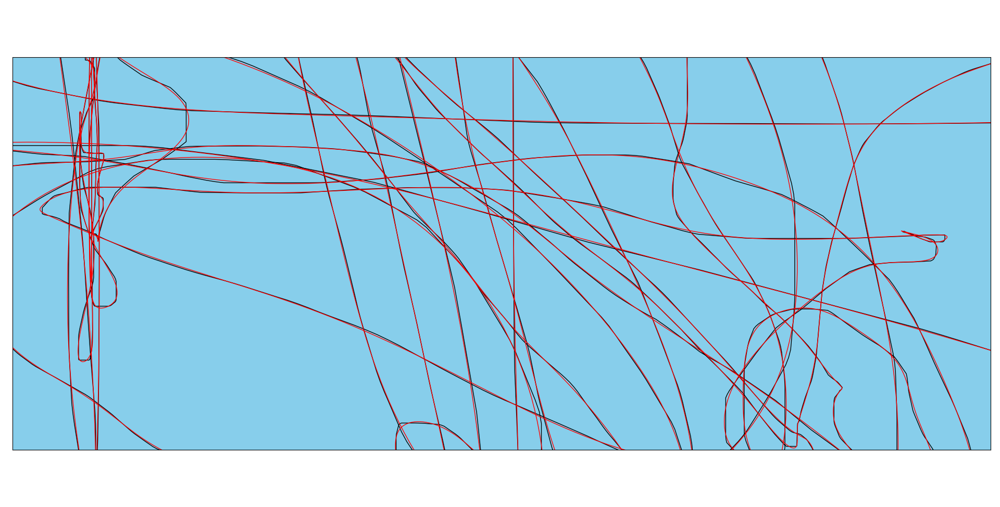

=======================
Tutorial: Data Analysis
=======================

In this tutorial we will have a look at how to analyze tracking data with the data models provided by floodlight. The goal is to load some sample data, do a quick pre-processing, calculate a set of performance metrics and print the results.

Setup
=====

Let's start by getting some data that we can work with. The public EIGD dataset contains 25 samples of handball tracking data from the German Men's Handball Bundesliga and fits our purpose. We load the dataset, query a single sample (the default sample) disregarding all but the home team data, and also get the corresponding pitch information.

.. code-block:: python

    from floodlight.io.datasets import EIGDDataset

    # get the default segment from the EIGD dataset
    dataset = EIGDDataset()
    home, _, _ = dataset.get()
    pitch = dataset.get_pitch()

The variable ``home`` that we get is a XY object and contains a five minute sample of tracking data with a total of 9000 frames for one team. This is the one we are going to analyze! The ``pitch`` variable is a Pitch object that contains information regarding the pitch specification and coordinate system our data live in.

Data Preparation
================

Before we jump into the analysis, we will have to do some pre-processing. Tracking data can generally be of very varying quality and contain artefacts such as rapid jumps in player positions. Such jumps can be problematic, depending on the analysis. Although the EIGD data is of good general quality, we will perform a filtering step in applying a lowpass Butterworth filter to smooth the trajectories and eliminate major jumps. As we want to calculate physical performance metrics later on, this will prevent that our results contain super-human abilities due to measurement errors.

To demonstrate the effect of the filter, we first create a small plot showing all players' trajectories for the first 5000 frames. This is also is a nice eyeball test to check if our data generally looks alright before we do any calculations!

.. code-block:: python

    import matplotlib.pyplot as plt

    # create a matplotlib plot
    fig, ax = plt.subplots()
    ax.set_title('Home Team Trajectories')

    # plot the pitch
    pitch.plot(ax=ax)

    # plot the home team trajectories for the first 5000 frames in black
    home.plot((1, 5000), plot_type='trajectories', color='black', ax=ax)

This looks alright! But one can see a few rough edges here and there that are likely due to measurement precision rather than the actual player movement. Thus, let's apply the filter and plot the data again in a different color onto the same axes. This will create an overlay and we can inspect how the filter smooths the data.

.. code-block:: python

    from floodlight.transforms.filter import butterworth_lowpass

    # filter the data and plot again in red
    home = butterworth_lowpass(home)
    home.plot((1, 5000), plot_type='trajectories', color='red', ax=ax)

These lines look almost identical. The filter (with default parameter) is a very gentle smoother, but we can see the effect if we zoom in a little:

That almost looks like art, but anyhow, our data is now ready for processing!

Data Models
===========

Let's try out some of the models that are part of the ``floodlight.models`` submodule. Each model is a separate class, so lets import them (and numpy, which we will need later on). To save our results, we also create a dictionary and add a list containing player "names".

.. code-block:: python

    import numpy as np

    from floodlight.models.kinematics import DistanceModel, VelocityModel
    from floodlight.models.kinetics import MetabolicPowerModel
    from floodlight.models.geometry import CentroidModel

    # dictionary for computed metrics
    metrics = {"Name": [f"Player {n}" for n in range(home.N)]}

Now it's time to do the number crunching! Luckily, our data is scaled in meter (given by the ``pitch.unit`` attribute), so we don't need to worry about unit systems and can start processing.

Using the data models always follows the same routine, which is inspired by the great scikit-learn package! Each model has a ``.fit()``-method which needs to be called after instantiation. This method does the heavy lifting, and once it's done, we can use the other class methods to query some results! For example:

.. code-block:: python

    # create - fit - query
    model1 = DistanceModel()
    model1.fit(home)
    distances = model1.cumulative_distance_covered()
    metrics["Total Dist. [m]"] = distances[-1]

This one calculates players' covered distances. After running the ``.fit()``-method, we could query the ``.distance_covered()``-method which returns a PlayerProperty object containing the frame-wise covered distance for each player and each time-frame. We want to check out what they've run in total over those five minutes, so let's instead query the ``.cumulative_distance_covered()``-method, which returns a PlayerProperty containing cumulated distances. At last, we take the last row of that object, which is the total distance covered, and save it in our ``metrics`` dictionary.

We can do the same trick with player velocities, but this time, let's check out the maximum value to see the player's top speeds:

.. code-block:: python

    model2 = VelocityModel()
    model2.fit(home)
    speeds = model2.velocity()
    metrics["Top Speed [m/s]"] = np.nanmax(speeds, axis=0)

Alright, let's check out some more advanced computations. The general syntax stays the same, so again we instantiate the model, call the ``.fit()``-method, query the desired result and save it in the ``metrics`` dictionary. Let's try this and calculate the metabolic power (an advanced biomechanical model that approximates internal physiological load during non-linear activities such as handball) as well as each player's distance to his team's centroid:

.. code-block:: python

    model3 = MetabolicPowerModel()
    model3.fit(home)
    metabolic_power = model3.cumulative_metabolic_power()
    metrics["Metabolic Work"] = metabolic_power[-1]

    model4 = CentroidModel()
    model4.fit(home)
    centroid_distance = model4.centroid_distance(home)
    metrics["Avg. Centroid Dist. [m]"] = np.nanmean(centroid_distance, axis=0)

That's it, let's check out the results!

Results
=======

We can use pandas to brush and display the results. So let's create a DataFrame, round the values to three decimal places, and show the first ten players of the data frame.

.. code-block:: python

    import pandas as pd

    # create and show DataFrame
    metrics = pd.DataFrame(metrics)
    metrics = metrics.round(3)
    print(metrics.head(10).to_string())

Here's the (formatted) result you should get:

=======  =================  ================  =================  =========================
Subject  Total Dist. [m]    Top Speed [m/s]   Metabolic Work     Avg. Centroid Dist. [m]
=======  =================  ================  =================  =========================
P 0           394.095             6.941           1669.19                       5.805
P 1           371.544             5.948           1536.22                       3.965
P 2           321.057             6.413           1461.03                       9.409
P 3           350.462             7.067           1488.61                       9.39
P 4           182.469             6.406            773.093                      4.92
P 5           371.928             5.606           1645.02                       3.412
P 6           211.308             3.181            746.941                     10.623
P 7           216.569             6.058            958.511                      4.584
P 8             0               nan                  0                        nan
P 9             0               nan                  0                        nan
=======  =================  ================  =================  =========================

And that's it! If you inspect the data a little closer, you'll find there are some players where all values are either NaN or 0. Those are the substitutes that did not play in the short snippet we've investigated. Feel free to expand the code and loop over the entire EIGD dataset to compare performances between teams and samples!
