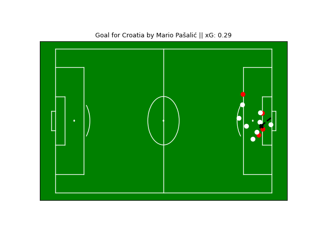
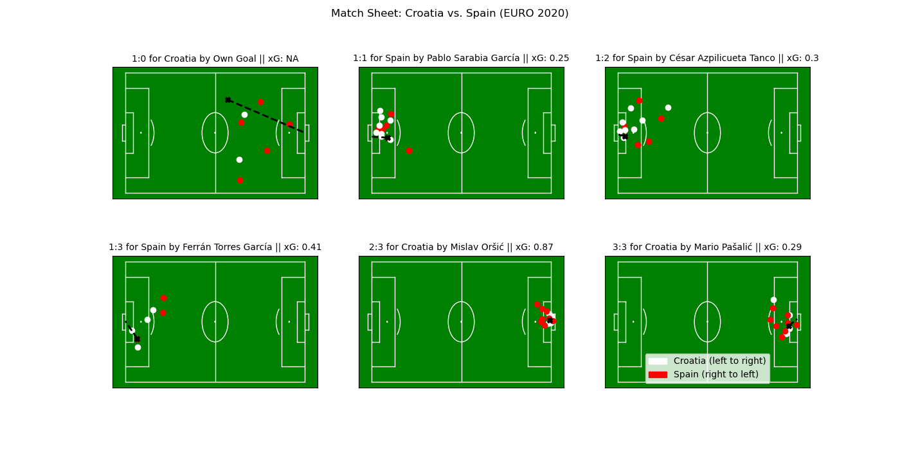

==============================
Tutorial: Match Sheet Creation
==============================

In this tutorial we will create match sheets from the openly published event data from StatsBomb with the interface and objects provided by floodlight. Our goal is to load a match from the dataset, extract information about the scored goals, and use this information to create a match sheet.

Setup
=====

First we need some data to work with. The open StatsBomb dataset contains (amongst others) data from the UEFA Euro 2020 with (partial) information about the player positions at the events which can be used for our purpose. From this dataset we load a single match from the dataset and also get the corresponding pitch information.

.. code-block:: python

    from floodlight.io.datasets import StatsBombOpenDataset

    # load a match from the UEFA Euro 2020
    dataset = StatsBombOpenDataset()
    home_ht1, home_ht2, away_ht1, away_ht2 = dataset.get("UEFA Euro", "2020", "Croatia vs. Spain")
    pitch = dataset.get_pitch()

The variables ``home_ht1``, ``home_ht2``, ``away_ht1``, and ``away_ht2`` are Events objects containing the events of the teams during the first and second half. These will be used to create the match sheets. The ``pitch`` variable is a Pitch object that contains information regarding the pitch specification and coordinate system our data live in.

Data Preparation
================

To create match sheets from the event data we want to select certain (important) events to look at. To keep it short and simple we stick to goals. We use the ``select`` function from the ``floodlight.core.events`` submodule to find all shots with a positive outcome (1).

.. code-block:: python

    home_goals_ht1 = home_ht1.select(
        conditions=[("event_name", "Shot"), ("outcome", 1)]
    )
    home_goals_ht2 = home_ht2.select(
        conditions=[("event_name", "Shot"), ("outcome", 1)]
    )
    away_goals_ht1 = away_ht1.select(
        conditions=[("event_name", "Shot"), ("outcome", 1)]
    )
    away_goals_ht2 = away_ht2.select(
        conditions=[("event_name", "Shot"), ("outcome", 1)]
    )

Similarly, we must not forget about own goals in the data!

.. code-block:: python

    home_owngoals_ht1 = home_ht1.select(
        conditions=[("event_name", "Own Goal For")]
    )
    home_owngoals_ht2 = home_ht2.select(
        conditions=[("event_name", "Own Goal For")]
    )
    away_owngoals_ht1 = away_ht1.select(
        conditions=[("event_name", "Own Goal For")]
    )
    away_owngoals_ht2 = away_ht2.select(
        conditions=[("event_name", "Own Goal For")]
    )

Finally, we collect all goals into a single pandas DataFrame.

.. code-block:: python

    import pandas as pd

    all_goals = pd.concat(
        (
            home_goals_ht1,
            home_goals_ht2,
            home_owngoals_ht1,
            home_owngoals_ht2,
            away_goals_ht1,
            away_goals_ht2,
            away_owngoals_ht1,
            away_owngoals_ht2,
        )
    ).sort_values("gameclock")

Here's the (formatted) DataFrame you should get:

====  ========== ====== ==== ======== ======== ============ ======= ======= ====== ===== ====== ===== ============= ======================== ========== ==========
eID   gameclock  pID    tID  mID      outcome  timestamp    minute  second  at_x   at_y  to_x   to_y  event_name    player_name              team_name  qualifier
====  ========== ====== ==== ======== ======== ============ ======= ======= ====== ===== ====== ===== ============= ======================== ========== ==========
25    1172.344   nan    785  3794686  nan      0:19:32.433  19      32      68.3   62.1  nan    nan   Own Goal For  None                     Croatia    ...
16    2248.398   6720   772  3794686  1        0:37:28.398  37      28      109.0  43.3  120.0  42.6  Shot          Pablo Sarabia Garcia     Spain      ...
16    3366.771   3957   772  3794686  1        0:11:06.771  56      6       115.3  42.4  120.0  41.0  Shot          Cesar Azpilicueta Tanco  Spain      ...
16    4562.056   6748   772  3794686  1        0:31:02.056  76      2       112.1  51.2  120.0  39.5  Shot          Ferran Torres Garcia     Spain      ...
16    5056.385   16527  772  3794686  1        0:39:16.385  84      16      119.0  40.9  120.0  42.5  Shot          Mislav Orsic             Croatia    ...
16    5511.058   11603  772  3794686  1        0:46:51.058  91      51      114.2  37.2  120.0  41.9  Shot          Mario Pasalic            Croatia    ...
====  ========== ====== ==== ======== ======== ============ ======= ======= ====== ===== ====== ===== ============= ======================== ========== ==========

Data Extraction
===============

Alright, now let's try to extract the relevant information from the above DataFrame. First we want to extract some meta information about the goals. For later use we write a function ``get_goal_info(goal)`` for that matter.

.. code-block:: python

    import ast

    def get_goal_info(goal):
        scoring_team = goal["team_name"]
        if goal["event_name"] == "Shot":
            scoring_player = goal["player_name"]
            xG = ast.literal_eval(goal["qualifier"])['shot']['statsbomb_xg']
        else:
            scoring_player = "Own Goal"
            xG = None
        return scoring_team, scoring_player, xG

Next, we deal with the previously mentioned StatsBomb360 position data. The appropriate floodlight object to deal with position data is a XY object. To create XY objects that relate to a single frame of the match we have to bring them into shape (1, N). Therefore we define the function ``get_xy_data(goal)``.

.. code-block:: python

    import numpy as np
    from floodlight import XY

    def get_xy_data(goal):
        # read positions at event
        freeze_frame = ast.literal_eval(goal["qualifier"])["360_freeze_frame"]

        # set "to-location" to goal center if not available
        if np.isnan(goal["to_x"]):
            goal["to_x"] = 120
        if np.isnan(goal["to_y"]):
            goal["to_y"] = 40

        # create arrays
        xy_ball = np.array([[goal["at_x"], goal["at_y"]], [goal["to_x"], goal["to_y"]]])
        xy_off = np.array(
            [player["location"] for player in freeze_frame if player["teammate"]]
        )
        xy_def = np.array(
            [player["location"] for player in freeze_frame if not player["teammate"]]
        )

        # reshape arrays to represent a single frame
        xy_off = xy_off.flatten()
        xy_off = xy_off.reshape((1, len(xy_off)))
        xy_def = xy_def.flatten()
        xy_def = xy_def.reshape((1, len(xy_def)))

        # return XY objects
        return XY(xy=xy_ball), XY(xy=xy_off), XY(xy=xy_def)

Plotting
========

Now we can use the predefined functions to create a plot of a single goal (e.g. the last) with the plotting functionality of the XY and Pitch object.

.. code-block:: python

    import matplotlib.pyplot as plt

    goal = all_goals.iloc[-1]

    fig, ax = plt.subplots()
    scoring_team, scoring_player, xG = get_goal_info(goal)
    ax[i, j].set_title(
        f"Goal for {scoring_team} by {str(scoring_player)} "
        f"|| xG: {round(xG, 2) if xG is not None else 'NA'}",
        fontdict={'size': 9}
    )
    pitch.plot(ax=ax)
    xy_ball, xy_off, xy_def = get_xy_data(goal)
    xy_off.plot(t=0, ax=ax, color="red")
    xy_def.plot(t=0, ax=ax, color="white")
    xy_ball.plot(t=(0, 2), plot_type="trajectories", color="cyan", ball=True, ax=ax)

This is a neat start! However, our goal is to summarize the whole match into a single match sheet that displays all the goals.

Therefore, we setup a grid of subplots (in this case a 2x3 grid for the six goals). We add a legend with our designated colors for the two teams.

.. code-block:: python

    import matplotlib.pyplot as plt
    import matplotlib.patches as mpatches

    rows = np.minimum(len(all_goals), 2)
    cols = int(np.ceil(len(all_goals) / 2))
    fig, ax = plt.subplots(rows, cols, figsize=(14, 7))
    plt.suptitle("Match Sheet: Croatia vs. Spain (EURO 2020)")
    plt.legend(
        handles=[
            mpatches.Patch(label="Croatia (left to right)", color="white"),
            mpatches.Patch(label="Spain (right to left)", color="red"),
        ]
    )

Now we create the match sheet by iterating over all goals and updating the respective subplots. For visibility we want to display the goals for Spain at the left side of the pitch. Therefore we use the ``rotate`` and ``translate`` function of the floodlight XY module.

.. code-block:: python

    row, col, home_score, away_score = 0, 0, 0, 0
    colors = {"Croatia": "white", "Spain": "red"}

    for _, goal in all_goals.iterrows():

        # display meta information
        scoring_team, scoring_player, xG = get_goal_info(goal)
        if scoring_team == "Croatia":
            conceding_team = "Spain"
            home_score += 1
        else:  # score by Spain
            conceding_team = "Croatia"
            away_score += 1
        ax[i, j].set_title(
            f"{home_score}:{away_score} for {str(scoring_team)} by {str(scoring_player)} "
            f"|| xG: {round(xG, 2) if xG is not None else 'NA'}",
            fontdict={'size': 10}
        )

        # get position data
        xy_ball, xy_off, xy_def = get_xy_data(goal)
        # rotate position data towards left goal for Spain
        if scoring_team == "Spain":
            xy_off.rotate(180)
            xy_off.translate((pitch.xlim[1], pitch.ylim[1]))
            xy_def.rotate(180)
            xy_def.translate((pitch.xlim[1], pitch.ylim[1]))
            xy_ball.rotate(180)
            xy_ball.translate((pitch.xlim[1], pitch.ylim[1]))
        # plot pitch and position data
        pitch.plot(ax=ax[i, j])
        xy_off.plot(t=0, ax=ax[i, j], color=colors[scoring_team])
        xy_def.plot(t=0, ax=ax[i, j], color=colors[conceding_team])
        xy_ball.plot(
            t=(0, 2), plot_type="trajectories", color="cyan", ball=True, ax=ax[i, j]
        )

        # update grid position
        col += 1
        if col == cols:
            col = 0
            row += 1

The result should look like below. However, keep in mind that the StatsBomb360 data does only contain the positions from some players at the event (extracted from the camera angle). That's why you can not see the player responsible for the own goal in the first plot.

Feel free to try out this code with other matches from the StatsBomb dataset (``dataset.available_matches``) and also to experiment with other event types, plotting styles and your own ideas!
